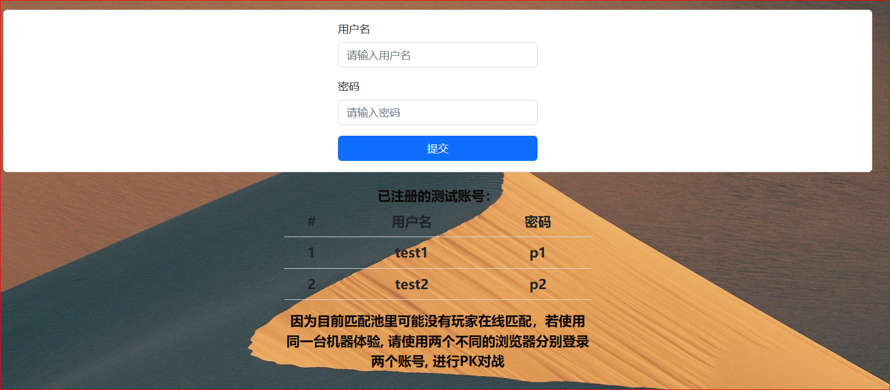
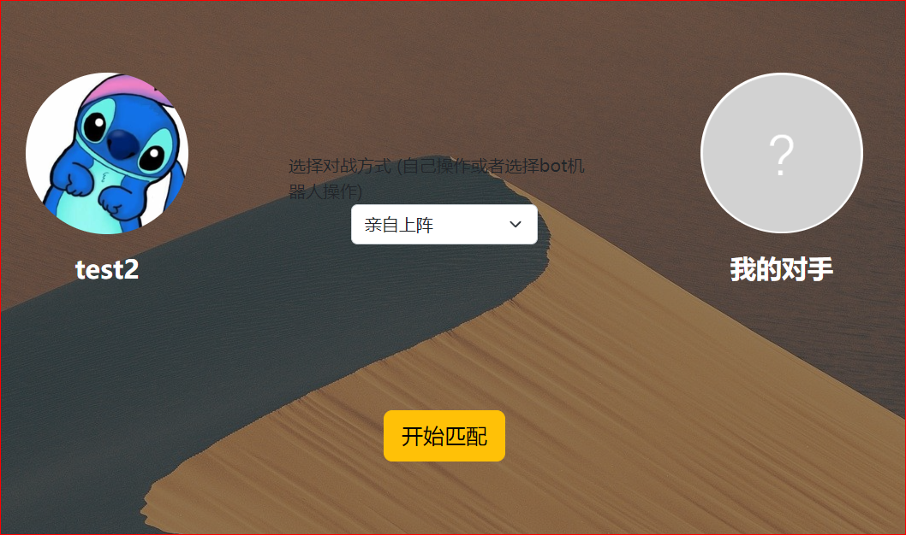
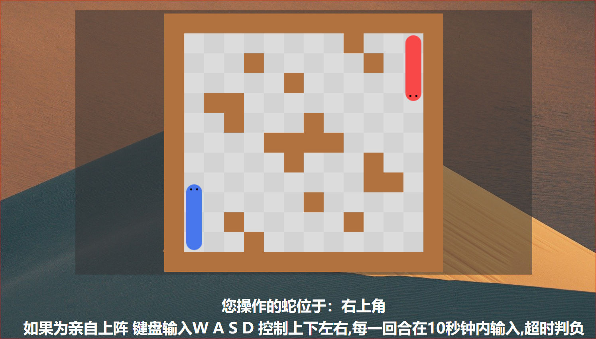

# Snake-Battle
项目体验链接：https://app5881.acapp.acwing.com.cn
# 项目介绍
《蛇蛇争霸》游戏对战平台是一个线上实时PK的对战平台，玩家通过在线匹配系统进行对手匹配，并通过键盘输入指令或者编写AI Bot代码来操控游戏中的蛇进行对抗，支持AI对战和人人对战，除PK对战以外平台还提供天梯分排行榜排名以及PK对战录像回放功能。

## 输入账号密码

## 选择对战的角色（自己操作或者选择自己的Bot蛇）

## 游戏对战
可能由于租的服务器太便宜，有时候会出现BUG哈哈！
选择AI蛇可以按照你自己设计的代码逻辑进行判断下一步要怎么走
选择亲自出战可以通过键盘输入 w a s d 来控制蛇的前 左 后 右

